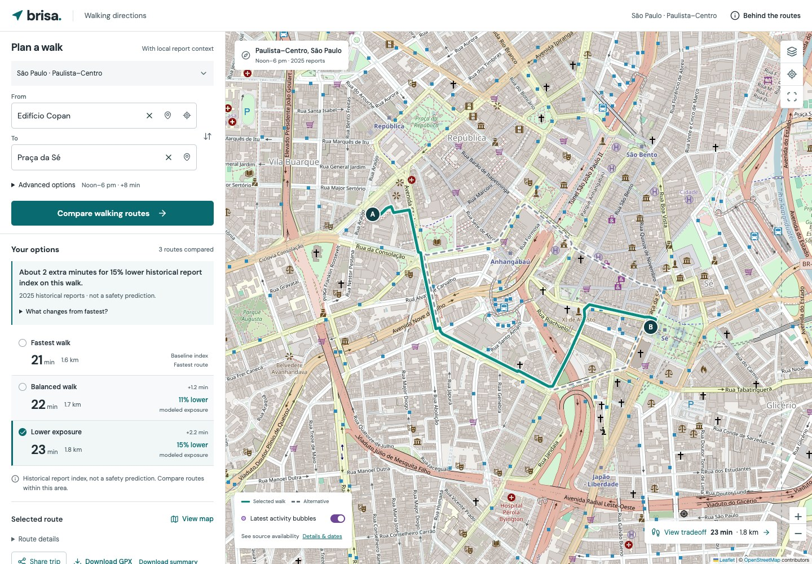
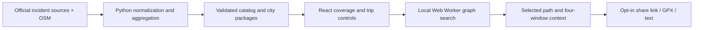

# Brisa

A BigRedHacks navigation project: compare walking routes using historical reported incidents and an explicit limit on added walking time. Inspired by our LATAM team's experiences, Brisa uses a shared routing engine with independently validated city data packages.



**Included coverage:** four bounded packages. Coverage is regional; a city label does not imply every neighborhood is supported.

| City | Coverage | Historical scope |
| --- | --- | --- |
| New York City | Central Manhattan | Source-specific eligible 2025 reports |
| Chicago | Loop | Source-specific eligible 2025 reports |
| San Francisco | Downtown | Street/public-place robbery only; 160 eligible 2025 reports |
| São Paulo, Brazil | Paulista–Centro | Pedestrian cellphone theft/robbery only; 2,466 eligible 2025 reports |

The selector and Show coverage control expose each package's actual boundary. Source definitions differ; these indices cannot rank cities. São Paulo includes only eligible pedestrian cellphone theft/robbery with precise occurrence times: 19,217 halo reports with missing or imprecise times are excluded, which can bias historical-window comparisons. This is not general crime coverage. See [source methodology](docs/DATA.md).

## Run locally

Requires Node.js 22.12+ (or compatible newer Node), npm, and Python 3.9+ for data tooling.

```sh
npm ci
npm run dev
```

Open the URL printed by Vite. NYC is the default; `/?area=chicago-loop` opens Chicago directly; `/?area=sf-downtown` opens San Francisco; `/?area=sao-paulo-centro` opens the working Brazil demo. No Google Maps key, paid API, backend, or account is needed. The app loads only the selected area's package. Routing runs locally in a Web Worker; optional background map tiles require internet. Bundled streets and routes remain available when tiles fail.

```sh
npm test                         # loaders, routing, worker, real-city integration
python3 scripts/test_data.py      # ingestion and package integrity
npm run build                    # TypeScript + production build
npm run preview                  # serve the production build
npx playwright install chromium  # once per machine, for browser tests
npm run test:e2e                  # desktop + mobile flows and city-switch races
```

An installed Chrome can be used with `PLAYWRIGHT_CHANNEL=chrome npm run test:e2e`. Tests use isolated browser profiles and suppress public tile requests. `npm run format` formats application and test source.

## Add another city

City data lives outside the application code. Configure coverage, provenance, timezone, dates, filters and landmarks, then run the common builder. There are official-source adapters for NYPD, Chicago, SFPD and São Paulo SSP, plus a normalized CSV adapter for other jurisdictions.

```sh
python3 scripts/build_data.py --list
python3 scripts/build_data.py --city nyc
python3 scripts/build_data.py --city chicago
python3 scripts/build_data.py --all --refresh
```

Read **[Adding cities](docs/ADDING_CITIES.md)** for the CSV contract, configuration example, graph import, cache behavior and validation checklist. A new city using the supported CSV contract does not require edits to React or the route engine. Other API schemas need a source adapter that produces the same normalized records.

Available public data still needs a usable occurrence time, location, incident definition, attribution and street coverage. The pipeline rejects incomplete data and unsupported schemas; the app does not infer coverage for arbitrary cities. Packages with no eligible observations cannot establish useful historical context.

## What the planner does

- Selects a city/coverage package, landmarks or map endpoints, a local historical time window, and an extra-time budget.
- Computes routes along real OpenStreetMap walking geometry and integrates the report index along each displayed path.
- Shows distinct fastest/lower-index candidates that satisfy the exact budget, with time and distance alongside exposure comparisons.
- Displays aggregate report context, package-specific dates, timezone, eligibility, sources and route explanations.
- Offers an optional latest-activity bubble layer: unverified SF dispatch calls and delayed published NYC/Chicago reports, with source windows and freshness visible. It does not change historical route scores; São Paulo has no verified recent feed.
- Shows contiguous street segments and four historical-window scores for the exact selected path.
- Shares a reproducible request only after an explicit action. Links disclose both endpoint coordinates and recalculate on open; they do not guarantee permanently identical routes. Ordinary control changes do not write coordinates into the address bar.
- Exports the selected geometry as GPX or its street sequence as text, with historical model/source context. These are planning references, not verified navigation instructions.
- Fits the map independently to package coverage or the selected comparison.
- Cancels old planning work on city switches, rejects unsupported points, and recovers from failed loads without displaying another city's routes.
- Opens a destination in Google Maps as a separate action. Google calculates its own route; the selected geometry and exposure estimate do not transfer.

The index is **modeled exposure to historical reports**, not a calibrated probability of harm. Reporting, foot traffic, policing, approximate coordinates and missing reports affect it. Offense definitions and eligibility differ by source. Scores are normalized within each package and must not be used to rank cities. This prototype does not provide current street-condition verification or turn-by-turn navigation.

## Architecture




| Part | Location | Responsibility |
| --- | --- | --- |
| Multi-city design | [docs/MULTICITY.md](docs/MULTICITY.md) | Coverage model, source boundaries and expansion decisions |
| Original council | [docs/PLAN.md](docs/PLAN.md) | Product tradeoffs and initial model |
| Demo walkthrough | [docs/DEMO.md](docs/DEMO.md) | Two-minute demo and local fallback |
| Pitch kit | [docs/PITCH.md](docs/PITCH.md) | Spoken pitch and factual submission draft |
| Manual deployment | [docs/DEPLOY.md](docs/DEPLOY.md) | Publication instructions; not a claim of a live deployment |
| Latest activity | [docs/LIVE_ACTIVITY.md](docs/LIVE_ACTIVITY.md), [docs/RECENT_SOURCES.md](docs/RECENT_SOURCES.md) | Optional feeds, delays, bubble semantics and failure behavior |
| Source methodology | [docs/DATA.md](docs/DATA.md) | Exact queries, filters, provenance and limitations |
| City onboarding | [docs/ADDING_CITIES.md](docs/ADDING_CITIES.md) | Add a supported public API/CSV package |
| City configuration | `configs/cities/` | Coverage, source adapters, metadata and landmarks |
| Ingestion | `scripts/build_data.py` | Download, normalize, aggregate, validate and register packages |
| Catalog and snapshots | `public/data/` | Discoverable coverage metadata and aggregate-only city packages |
| Package validation | `src/data/loaders.ts` | Schema, identity, dates, grid, halo and graph checks before display |
| Routing | `src/domain/routing.ts` | Spatially indexed sampling, cached scores and graph search |
| Background planner | `src/domain/planner-client.ts`, `planner-worker.ts` | Dataset-scoped worker and cancellable request lifecycle |
| UI | `src/App.tsx`, `src/styles.css` | City-independent responsive planner and map |

A new city is a new data package, not a new application. Larger regional coverage can be partitioned into packages; continuous routing across packages would require graph stitching or a server-side graph service. The current app deliberately loads one bounded connected graph at a time. It does not combine independently normalized packages or route across unloaded boundaries.

## Refresh and deployment

With latest activity off (the default), committed packages make route demos independent of incident-source and Overpass APIs. Enabling latest activity requires network access to official feeds; failures never substitute fixture data. Historical-package refresh is an explicit build-time operation. Cache identities include source/query/configuration; failed downloads preserve the last valid cache. Historical raw case records stay in ignored local caches and are never served by the app. The optional activity layer fetches minimal official records transiently in the browser and displays aggregate bubbles.

After changing data, run Python validation, `npm test`, and `npm run build`. Deploy the resulting `dist/` as one release so the catalog and its data packages stay consistent. Root hosting is the default; [GitHub Pages instructions](docs/DEPLOY.md) cover project paths through `BASE_PATH`. GitHub Actions checks packages, algorithms, workers, production build and browser flows, including automated accessibility checks.

All `VITE_` values are public browser configuration. `.env.example` documents the optional tile URL; never put private credentials there. Follow the selected tile provider's attribution and usage rules. There is no bulk tile downloader or service worker.

## Attribution

- [NYPD Complaint Data Historic](https://data.cityofnewyork.us/Public-Safety/NYPD-Complaint-Data-Historic/qgea-i56i/about_data), NYC Open Data.
- [City of Chicago, Crimes 2001 to Present](https://data.cityofchicago.org/Public-Safety/Crimes-2001-to-Present/ijzp-q8t2/data).
- [SFPD Incident Reports 2018 to Present](https://data.sf.gov/Public-Safety/Police-Department-Incident-Reports-2018-to-Present/wg3w-h783), DataSF; the included package uses a narrow street/public-place robbery filter.
- [SSP-SP Celulares Subtraídos](https://www.ssp.sp.gov.br/estatistica/consultas), São Paulo state public-security source; derived pedestrian-report aggregates retain attribution. The workbook is an exploratory raw release, not official crime statistics.
- Streets: © [OpenStreetMap contributors](https://www.openstreetmap.org/copyright), ODbL. Derived street data retain that license, separately from incident aggregates.
- [OpenStreetMap tile policy](https://operations.osmfoundation.org/policies/tiles/).
- DM Sans and Manrope are bundled locally under the SIL Open Font License; source URLs and licenses are in [public/fonts](public/fonts/PROVENANCE.txt).

See the individual sources' terms and data notes. The team has not selected a license for application code; no blanket license is asserted over third-party data.
