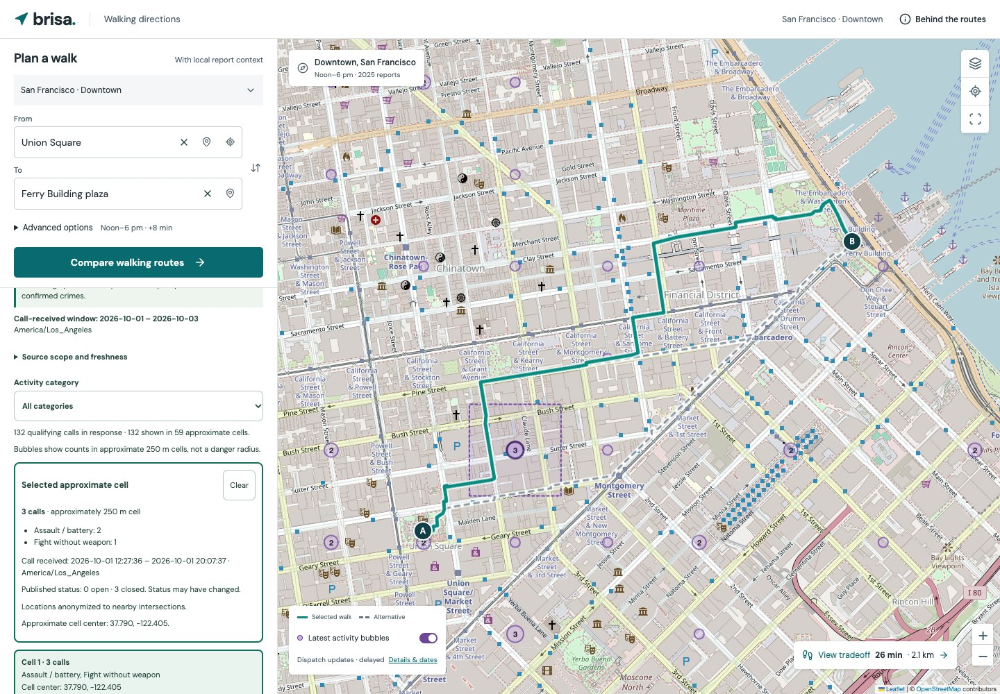

# Brisa demo walkthrough

## Rehearse locally

```sh
npm ci
npm run dev
```

Open the printed local URL. NYC is the app default. For the LATAM demo, open `/?area=sao-paulo-centro`; `/?area=chicago-loop` and `/?area=sf-downtown` select the other packages. Prepare dependencies before the event. The committed graph, aggregate packages and fonts work from the local server; optional background map tiles use the network. Activity bubbles start ON and use official-source network access where a feed exists. Turn them OFF for a historical-only demo. Address autocomplete uses Photon; bundled place names and map selection remain available when it is unavailable.

## Two-minute working demo

1. **0:00 — Start one real decision.** Open São Paulo, expand **Advanced options** and select **Try example walk** to restore Edifício Copan → Praça da Sé, noon–6 pm and an eight-minute budget. Collapse Advanced options. Point out the editable From/To fields and introduce the team's LATAM motivation: comparing historical report context alongside walking time.
2. **0:20 — Choose the tradeoff.** Select Fastest walk, then a distinct lower-exposure choice if available. Read the generated takeaway rather than doing mental arithmetic. The current example is about two extra minutes for a 15% lower historical report index (20.30 versus 22.53 minutes, 14.89% unrounded). Use actual displayed values after any model/data change. A distinct alternative is not promised for every request.
3. **0:50 — Make the detour concrete.** Open **What changes from fastest?** Show the measured shared/different street sections and the named sections on each walk. Names describe where geometry differs, not why incidents occurred or whether a street is accessible, well lit or safe. Different sections can have the same street name.
4. **1:20 — Make the choice portable.** Select **Share trip**, show the endpoint-coordinate disclosure and generated link. Explain that opening it recalculates the request; GPX preserves selected geometry. Keep copying, reopening and downloading for questions.
5. **1:40 — State scope.** Use the map’s **Show coverage boundary** control and conclude: “São Paulo uses 2,466 eligible pedestrian cellphone theft/robbery reports with known times. Missing times introduce bias. This compares historical report indices, not personal safety or cities.” Leave the selected walk on screen.

## Optional questions and demonstrations

- **Does the budget matter?** Expand **Advanced options**, set the extra-time budget to zero and compare. Restore the example with Try example walk. Do not imply every budget returns three routes.
- **Does time change the explanation?** Expand **Route details**, then show Same walk, different windows: four historical scores for the exact selected geometry. These are not current predictions.
- **Can I choose another street?** Type in **From** or **To**. Suggestions combine bundled street/landmark names with Photon addresses and places, bounded to the selected area. Select a result before comparing; map pins and explicit device location are alternatives. Places outside loaded coverage cannot be routed.
- **Can I take it with me?** Open the shared link or download GPX/summary. Street sequences are planning references, not verified turn instructions.
- **What has updated recently?** Use the separate SF segment below, with network access. It does not modify the historical routing model.

For a spoken script and submission draft, use [PITCH.md](PITCH.md).

Actual app captures are available for the presentation: [desktop comparison](screenshots/sao-paulo-desktop.jpg), [mobile map](screenshots/sao-paulo-mobile.jpg) and [mobile tradeoff](screenshots/sao-paulo-tradeoff-mobile.jpg). They show the committed São Paulo demo, with OpenStreetMap attribution retained on map captures; they do not establish a public deployment or current street conditions.

## Optional 30-second activity segment

After the Brazil walkthrough, switch to San Francisco. Activity is already ON unless you turned it off; the OFF choice persists across city changes. Open **Activity details** or tap a bubble. Show an aggregate bubble and the source dates. Say: “These are selected, unverified police dispatch calls received during the last 48 hours. The source updates every ten minutes with an additional ten-minute delay; Brisa checks for newly published batches every minute while visible. They do not change the historical route scores.” Do not promise a fixed count or current street conditions. If loading fails, show the explicit error/stale state and continue the historical demo; there is no fixture fallback.



This screenshot captures the live-source response observed on October 3, 2026; counts and source dates will change.

NYC instead shows 30 calendar days ending on its latest published occurrence date, from a quarterly source. Chicago uses the same latest-published window with daily updates that omit at least the newest seven days. São Paulo has no verified recent feed. See [LIVE_ACTIVITY.md](LIVE_ACTIVITY.md) and [RECENT_SOURCES.md](RECENT_SOURCES.md).

## Included packages

Counts below describe the committed snapshots, not live incident totals. All use 2025 historical reports.

| Package | Source extract count | Eligible reports | Aggregate cells | OSM nodes | OSM edges |
| --- | ---: | ---: | ---: | ---: | ---: |
| NYC · Central Manhattan | 90,116 | 5,497 | 1,050 | 73,021 | 91,746 |
| Chicago · Loop | 21,349 | 3,064 | 270 | 21,232 | 25,669 |
| San Francisco · Downtown | 48,533 | 160 | 400 | 22,819 | 29,178 |
| São Paulo · Paulista–Centro | 32,552 | 2,466 | 576 | 29,861 | 35,551 |

**Count units:** The US counts are retrieved source rows. São Paulo’s 32,552 count is distinct latest-version reports with coordinates in the incident halo, not workbook rows. The complete workbook contains 383,635 physical data rows and 309,326 distinct publisher report keys; repeated phone/person/offense rows are deduplicated before aggregation. Of the halo reports, 19,217 with missing or imprecise occurrence times are excluded under the timestamp eligibility rule. This known-time subset can introduce time-reporting bias; it is not representative general-crime coverage.

NYC is a rectangle from Battery Park through Columbus Circle; Chicago covers the Loop; SF covers a downtown rectangle; São Paulo covers a Paulista–Centro rectangle. None represents its entire city. Eligibility follows source-specific rules. SF is explicitly limited to street/public-place robbery; a small count does not establish a safer city. São Paulo includes pedestrian cellphone theft/robbery only. Historical raw case records are not bundled. The optional activity layer fetches minimal official records transiently and displays aggregates.

São Paulo's MASP landmark is named **MASP · Paulista sidewalk**. Its reviewed surface-sidewalk OSM node avoids the geometrically closer Nove de Julho tunnel; it is not a verified museum entrance or a general street-access audit. See [DATA.md](DATA.md) for source and geometry checks.

## If the demo network fails

- Keep the local Vite server running and reload the local app. Bundled streets and routes remain available when background tile requests fail; the app shows a map-unavailable explanation.
- If dependencies are already installed, `npm run build` followed by `npm run preview` serves the production bundle locally. Open the URL that command prints. The historical route demo needs no incident API or Google key; turn latest activity OFF without network access and use bundled places or map selection.
- Do not refresh source data at the event. The committed packages are the demo inputs; ingestion is a separate operation.
- If a package load fails, use Try again or switch coverage. Invalid shared links show a notice and fall back to default landmarks. Identical endpoints and points outside supported street coverage produce recoverable errors.
- The installed web app can reopen its cached shell and saved city packages; confirm the offline status in Advanced options before the demo. Native phone builds bundle all four packages. Tiles, address search and recent activity still need internet. See [phone app setup](APP.md); a prepared local server is also a dependable network fallback.

## What is implemented and checked

Routing runs in a Web Worker over a real OSM graph. The engine integrates the historical index along route geometry and searches 18 time/exposure tradeoffs, displaying at most three distinct budget-compliant candidates. This is not a guarantee of globally optimal constrained routing.

Run `npm test`, `python3 scripts/test_data.py`, `npm run build`, and `npm run test:e2e`. Browser tests use actual workers and suppress public tile requests. Covered flows include city switching, load recovery, route selection, exact selected GPX coordinates, share-link roundtrips, invalid links, stale-action removal, street sequences and the four-window profile on desktop and mobile. The refinement suite also covers local name search, keyboard map selection, example reset, route explanations and delayed worker completion during endpoint selection. Tests validate implementation behavior; they do not establish predictive accuracy, physical accessibility or improved personal safety.

## Honest answers for judges

**Is it a safe-route predictor?** No. It models exposure to historical reports. Reporting, pedestrian activity, policing, approximate coordinates and missing incidents affect the data.

**Can I navigate with it?** The path and GPX are planning references. Current access, crossings, barriers and physical accessibility are not audited. There are no verified turn instructions. The optional Google Maps destination handoff calculates a separate route.

**What does sharing reveal?** Both endpoint coordinates, the area and planning settings. Sharing requires an explicit action. The app has no accounts or continuous location tracking; this is not a claim that external tile providers or hosting logs collect nothing.

**Can you add my city?** Compatible public data can become a new package using [Adding cities](ADDING_CITIES.md). A usable location, occurrence time, incident definition, source rights and street graph are prerequisites. São Paulo Paulista–Centro is the current LATAM package. Other LATAM jurisdictions require their own source evaluation; this does not imply region-wide coverage.

**Is it live?** Historical routing packages are bundled. The optional SF activity layer updates from delayed, unverified dispatch calls; NYC/Chicago show delayed published reports. This is not live crime confirmation. Publication is a separate manual step described in [DEPLOY.md](DEPLOY.md); do not claim a public deployment before it exists.
